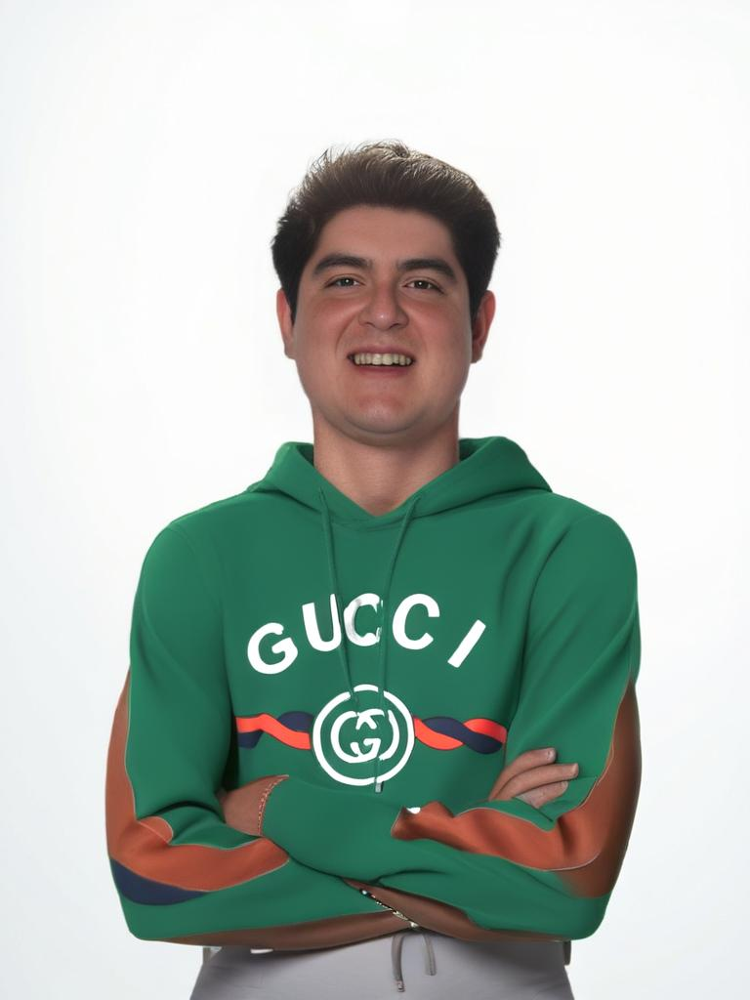
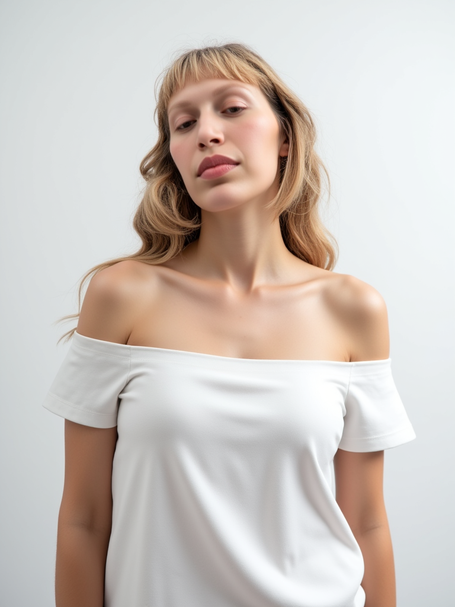
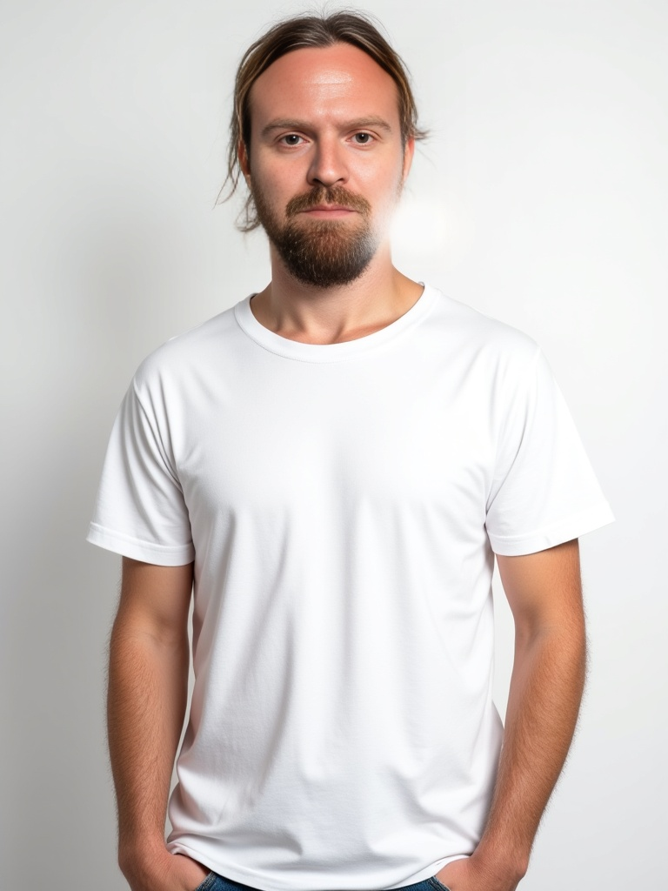
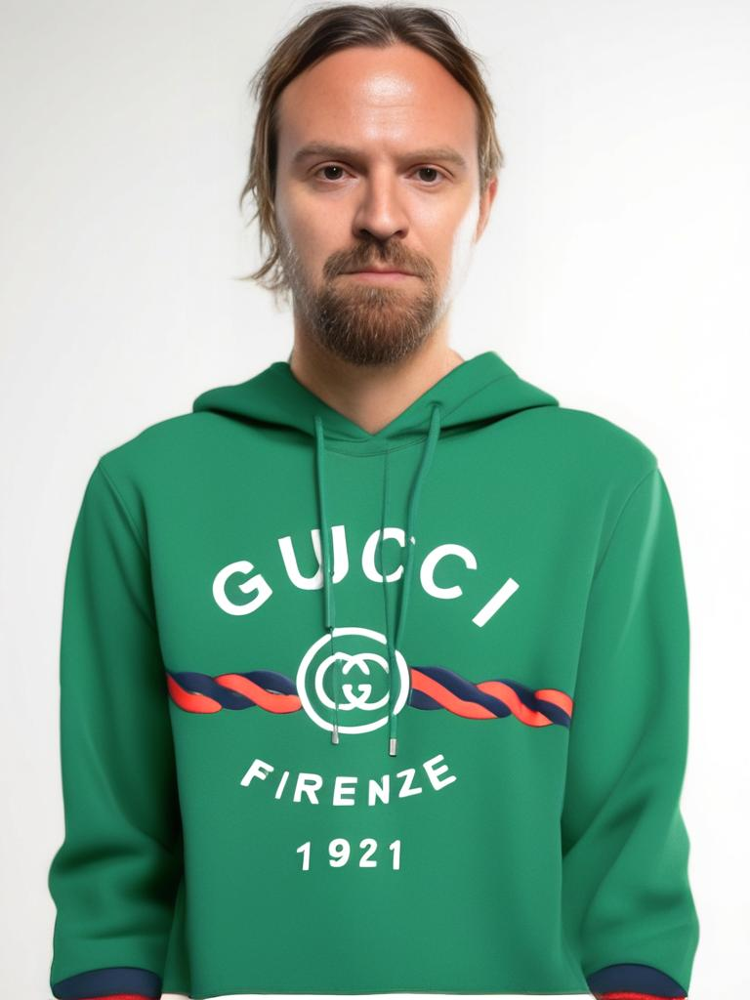
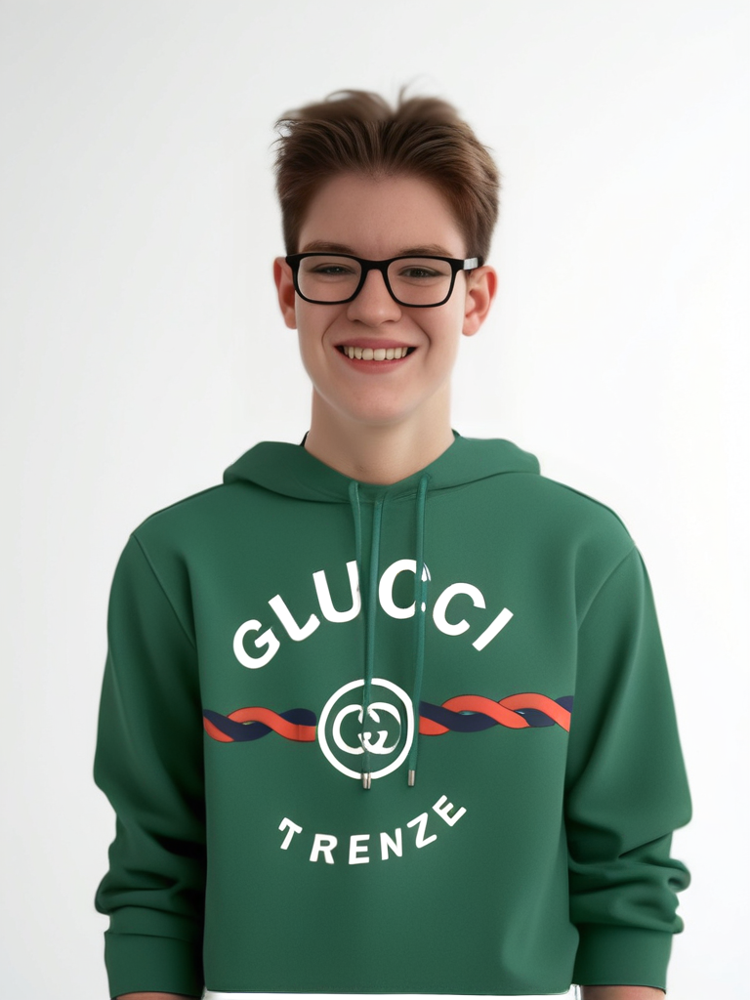

# Zeely AI Avatar Generator Pipeline

Automated three-stage engine: **user photo → studio avatar → virtual try-on outfit**.  
All inference runs on [fal.ai](https://fal.ai) — single API key, single billing dashboard.

---

## Quick Start

```bash
pip install -r requirements.txt

export FAL_KEY="your-key"   # https://fal.ai/dashboard/keys

# Add inputs
# input/users/   ← user photos (JPG/PNG/WebP)
# input/outfits/ ← garment reference images

python pipeline.py
```

---

## Results

<table>
<tr><th>User</th><th>Input</th><th>Avatar</th><th>Outfit Transfer</th></tr>
<tr>
<td>001</td>
<td></td>
<td></td>
<td></td>
</tr>
<tr>
<td>002</td>
<td></td>
<td></td>
<td></td>
</tr>
<tr>
<td>003</td>
<td></td>
<td></td>
<td></td>
</tr>
<tr>
<td>004</td>
<td></td>
<td></td>
<td></td>
</tr>
</table>

---

## Architecture

Three stages, all on fal.ai:

```
User Photo ──────────────────────────────────────────────────────────────────┐
  + user_attributes.json (glasses, body type, hair)                          │
                                                                              ▼
                                                              [FLUX PuLID] ──→ studio portrait
                                                                              │
                                                           [fal.ai face-swap] ──→ avatar.png
                                                                              │
Garment Image ──────────────────────────────── [FASHN v1.6 Try-On] ──→ avatar_outfit.png
                                                                              │
                                                                     [QA Scoring]
                                                                              │
                                                                    batch_report.json
```

| Stage | Model | Role |
|-------|-------|------|
| 1a | `fal-ai/flux-pulid` | Generates studio portrait with correct body, pose, lighting |
| 1b | `fal-ai/face-swap` | Pins real face back onto PuLID body (fixes identity drift) |
| 2 | `fal-ai/fashn/tryon/v1.6` | Transfers garment onto avatar, preserving text and patterns |

---

## User Attributes System

Per-user customization without code changes. Edit `input/users/user_attributes.json`:

```json
{
  "001.webp": {
    "glasses": false,
    "body_description": "heavyset young man with broad shoulders and round face"
  },
  "002.jpg": {
    "glasses": true,
    "glasses_description": "round pink-tinted glasses",
    "body_description": "slim young woman with narrow shoulders"
  }
}
```

**`body_description`** — injected into the PuLID prompt before generation; controls gender, build, and hair color. PuLID uses this to shape the generated body before face-swap pins the real face.

**`glasses`** — when `true`, the `glasses_description` is injected into the PuLID prompt so glasses are generated as part of the portrait (not added by face-swap, which would lose them).

---

## CLI Reference

```
python pipeline.py [options]

Options:
  -i, --input DIR          User photos directory       (default: input/users)
  -f, --outfits DIR        Garment images directory    (default: input/outfits)
  -o, --output DIR         Output directory            (default: output)
  -p, --preset NAME        Prompt preset: studio | fashion | ecommerce
  -c, --category CAT       Garment category: upper_body | lower_body | dresses
  --parallel               Enable parallel batch processing (3 workers)
  -s, --single PATH        Process a single user photo instead of batch
  --outfit-single PATH     Garment image to use in single mode
  --qa-only PATH           Score an existing image without generating
```

**Examples:**

```bash
python pipeline.py                                      # Batch, defaults
python pipeline.py --preset fashion                     # Fashion editorial preset
python pipeline.py --parallel                           # Parallel batch
python pipeline.py -s input/users/001.webp              # Single user
python pipeline.py -s input/users/001.webp \
  --outfit-single input/outfits/shirt.webp              # Single user + specific garment
python pipeline.py -o output_denim \
  -f input/outfits_denim                                # Custom output + outfit dir
python pipeline.py --qa-only output/001/avatar.png      # QA score only
```

---

## Output Structure

```
output/
├── 001/
│   ├── avatar.png          # 768×1024, white background, studio portrait
│   └── avatar_outfit.png   # Same person wearing the garment
├── 002/
│   ├── avatar.png
│   └── avatar_outfit.png
├── 003/ ...
├── 004/ ...
└── batch_report.json       # Full QA metrics and timings per user
```

---

## Pipeline Evolution

Started with BiRefNet background removal + IDM-VTON → cutout approach produced inferior results compared to full AI-generated studio portraits → pivoted to PuLID as primary generator → added face-swap for identity preservation → migrated from IDM-VTON (Replicate) to FASHN v1.6 (fal.ai) for garment text and pattern preservation → consolidated entire pipeline onto fal.ai.

See [ARCHITECTURE.md](ARCHITECTURE.md) for the full technical narrative.

---

## Cost Per User

| Stage | Model | Est. cost |
|-------|-------|-----------|
| Avatar generation | FLUX PuLID | ~$0.055 |
| Face restoration | fal.ai face-swap | ~$0.003 |
| Outfit transfer | FASHN v1.6 | ~$0.075 |
| **Total** | | **~$0.13 / user** |

---

## Dependencies

```
fal-client>=0.5.0
Pillow>=10.0.0
requests>=2.31.0
numpy>=1.24.0
```

Python 3.10+. No GPU required — all inference is cloud API.
