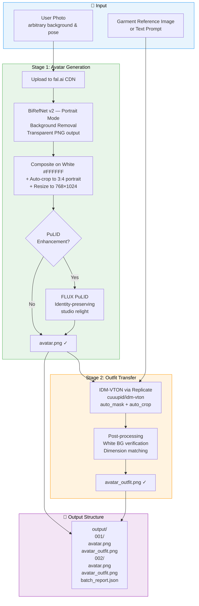

```mermaid
flowchart TD
    subgraph INPUT["📁 Input"]
        A[User Photo<br/>arbitrary background & pose]
        G[Garment Reference Image<br/>or Text Prompt]
    end

    subgraph STEP1["Stage 1: Avatar Generation"]
        B[Upload to fal.ai CDN]
        C[BiRefNet v2 — Portrait Mode<br/>Background Removal<br/>Transparent PNG output]
        D[Composite on White #FFFFFF<br/>+ Auto-crop to 3:4 portrait<br/>+ Resize to 768×1024]
        E{PuLID<br/>Enhancement?}
        F[FLUX PuLID<br/>Identity-preserving<br/>studio relight]
        H[avatar.png ✓]
    end

    subgraph STEP2["Stage 2: Outfit Transfer"]
        I[IDM-VTON via Replicate<br/>cuuupid/idm-vton<br/>auto_mask + auto_crop]
        J[Post-processing<br/>White BG verification<br/>Dimension matching]
        K[avatar_outfit.png ✓]
    end

    subgraph OUTPUT["📁 Output Structure"]
        L["output/<br/>  001/<br/>    avatar.png<br/>    avatar_outfit.png<br/>  002/<br/>    avatar.png<br/>    avatar_outfit.png<br/>  batch_report.json"]
    end

    A --> B
    B --> C
    C --> D
    D --> E
    E -- Yes --> F
    F --> H
    E -- No --> H
    H --> I
    G --> I
    I --> J
    J --> K
    K --> L
    H --> L

    style INPUT fill:#e8f4fd,stroke:#2196F3,color:#000
    style STEP1 fill:#e8f5e9,stroke:#4CAF50,color:#000
    style STEP2 fill:#fff3e0,stroke:#FF9800,color:#000
    style OUTPUT fill:#f3e5f5,stroke:#9C27B0,color:#000
```
